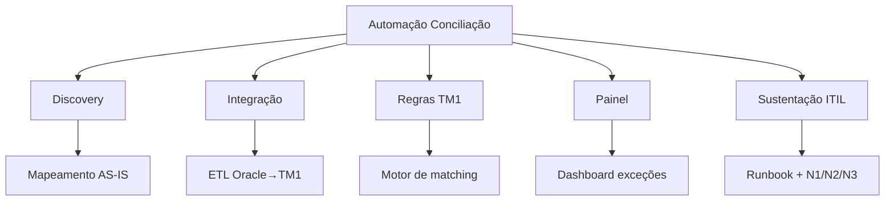

# Escopo e EAP

```mermaid
graph TD
    P[Automação Conciliação] --> A[Discovery]
    P --> B[Integração]
    P --> C[Regras TM1]
    P --> D[Painel]
    P --> E[Sustentação ITIL]
    A --> A1[Mapeamento AS-IS]
    B --> B1[ETL Oracle→TM1]
    C --> C1[Motor de matching]
    D --> D1[Dashboard exceções]
    E --> E1[Runbook + N1/N2/N3]
```
