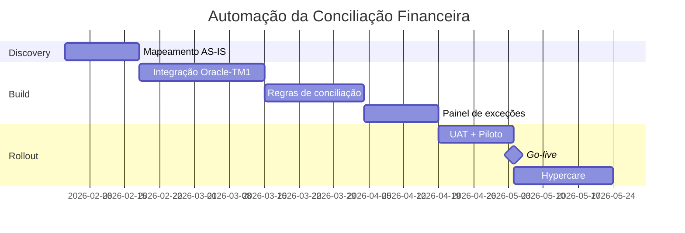

[04-cronograma.md](https://github.com/user-attachments/files/30234943/04-cronograma.md)
# Cronograma

```mermaid
gantt
    title Automação da Conciliação Financeira
    dateFormat YYYY-MM-DD
    section Discovery
    Mapeamento AS-IS :d1, 2026-02-03, 15d
    section Build
    Integração Oracle-TM1 :d2, after d1, 25d
    Regras de conciliação :d3, after d2, 20d
    Painel de exceções    :d4, after d3, 15d
    section Rollout
    UAT + Piloto :d5, after d4, 15d
    Go-live      :milestone, m1, after d5, 0d
    Hypercare    :d6, after m1, 20d
```
