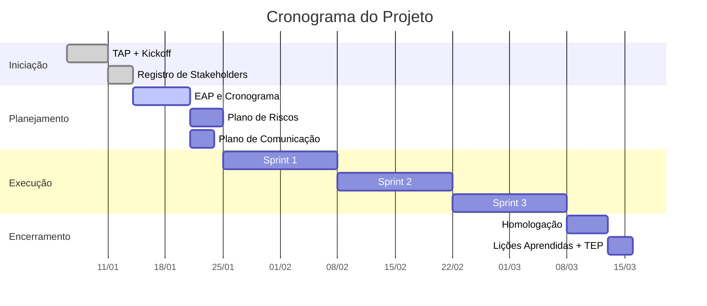

# 📅 Cronograma — Gantt

```mermaid
gantt
    title Cronograma do Projeto
    dateFormat  YYYY-MM-DD
    axisFormat  %d/%m

    section Iniciação
    TAP + Kickoff            :done,    i1, 2026-01-06, 5d
    Registro de Stakeholders :done,    i2, after i1, 3d

    section Planejamento
    EAP e Cronograma         :active,  p1, after i2, 7d
    Plano de Riscos          :         p2, after p1, 4d
    Plano de Comunicação     :         p3, after p1, 3d

    section Execução
    Sprint 1                 :         e1, after p2, 14d
    Sprint 2                 :         e2, after e1, 14d
    Sprint 3                 :         e3, after e2, 14d

    section Encerramento
    Homologação              :         f1, after e3, 5d
    Lições Aprendidas + TEP  :         f2, after f1, 3d
```

## Marcos
| Marco | Data prevista | Responsável |
|-------|---------------|-------------|
| Kickoff aprovado | | |
| Go-live | | |
| Encerramento | | |
