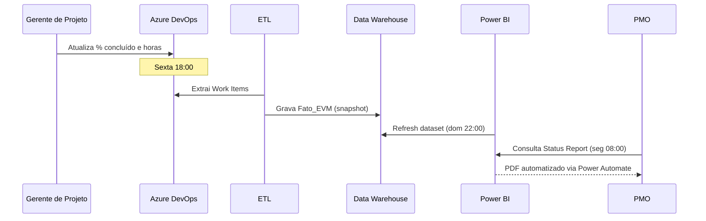

# Fluxo semanal EVM

```mermaid
sequenceDiagram
    participant PM as Gerente de Projeto
    participant ADO as Azure DevOps
    participant ETL as ETL
    participant DW as Data Warehouse
    participant PBI as Power BI
    participant PMO as PMO
    PM->>ADO: Atualiza % concluído e horas
    Note over ADO: Sexta 18:00
    ETL->>ADO: Extrai Work Items
    ETL->>DW: Grava Fato_EVM (snapshot)
    PBI->>DW: Refresh dataset (dom 22:00)
    PMO->>PBI: Consulta Status Report (seg 08:00)
    PBI-->>PMO: PDF automatizado via Power Automate
```
