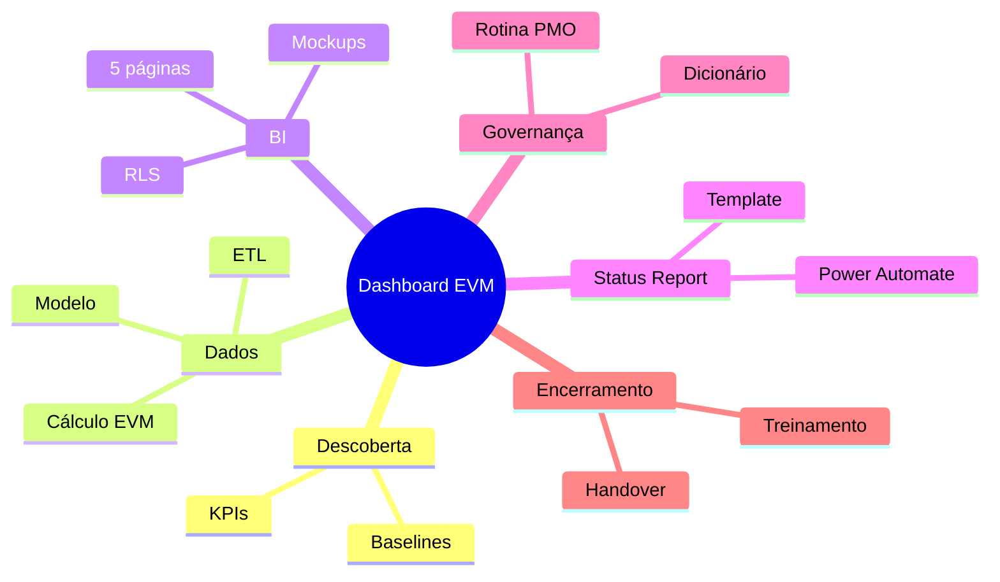

# EAP visual

```mermaid
mindmap
  root((Dashboard EVM))
    Descoberta
      KPIs
      Baselines
    Dados
      Modelo
      ETL
      Cálculo EVM
    BI
      Mockups
      5 páginas
      RLS
    Status Report
      Template
      Power Automate
    Governança
      Dicionário
      Rotina PMO
    Encerramento
      Treinamento
      Handover
```
