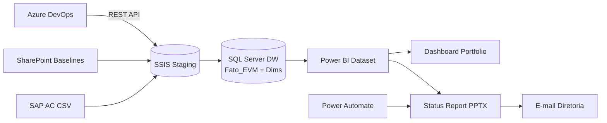

# Arquitetura de Dados

```mermaid
flowchart LR
    A[Azure DevOps] -->|REST API| S[(SSIS Staging)]
    B[SharePoint Baselines] --> S
    C[SAP AC CSV] --> S
    S --> DW[(SQL Server DW<br/>Fato_EVM + Dims)]
    DW --> PBI[Power BI Dataset]
    PBI --> D1[Dashboard Portfolio]
    PBI --> D2[Status Report PPTX]
    PA[Power Automate] --> D2
    D2 --> Mail[E-mail Diretoria]
```
